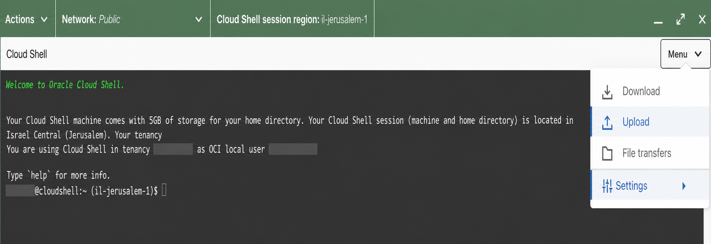
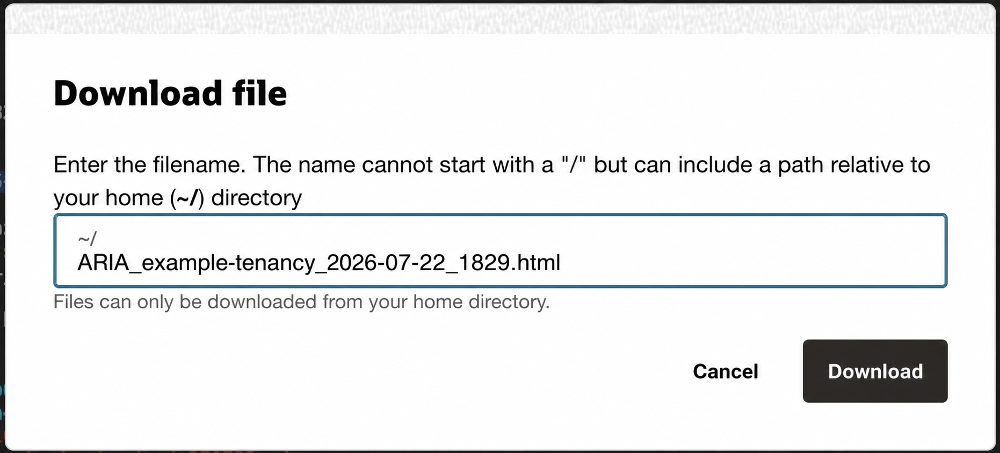

# ARIA - Analysis Risk IAM

ARIA is one portable Python script for reviewing Oracle Cloud Infrastructure
(OCI) IAM policies. It uses the OCI CLI already configured in OCI Cloud Shell
or on your local computer, analyzes policy statements locally, and creates one
self-contained HTML report.

The collector makes read-only OCI IAM requests only. ARIA never asks for OCI
credentials, uploads policy data, or writes JSON, CSV, or temporary collector
files. Each run creates only `ARIA_<tenancy_name>_<date>_<time>.html`.

## Important disclaimer

ARIA is an independent third-party tool. It is not an Oracle product and is
not affiliated with, endorsed by, sponsored by, or supported by Oracle or its
affiliates. It is provided **as is** and **as available**, without warranties.
You are responsible for validating its output and for every decision or action
taken based on it. Use ARIA at your own risk and according to your
organization’s security, legal, and compliance requirements.

Oracle is a registered trademark of Oracle Corporation and/or its affiliates.

## Choose how to run ARIA

| Option | Best for | Requirements |
| --- | --- | --- |
| [OCI Cloud Shell](#option-1--run-in-oci-cloud-shell) | No local installation | OCI Console access and IAM read permission |
| [Local computer](#option-2--run-locally-with-oci-cli) | Repeated use or local workflow | Python 3.11+ and configured OCI CLI |

## Before you start

- Use an OCI identity that can list compartments and IAM policies.
- In OCI Console, switch to the tenancy's **home region** before opening Cloud Shell.
- Download [aria.py](aria.py). It is the only ARIA file you need.

## Option 1 — Run in OCI Cloud Shell

1. In the OCI Console home region, open **Cloud Shell**.

2. From the Cloud Shell menu, select **Upload**, then upload `aria.py`.

   

3. Validate the OCI CLI profile. This does not call OCI or create a report.

   ```bash
   python3.11 aria.py --dry-run
   ```

4. Run ARIA. It shows progress while it reads tenancy, compartment, and policy
   information. A large tenancy can take a few minutes.

   ```bash
   python3.11 aria.py
   ```

   For a larger tenancy, use up to four concurrent policy requests:

   ```bash
   python3.11 aria.py --workers 4
   ```

5. When ARIA prints the report filename, use the Cloud Shell menu’s
   **Download** action and enter that exact `.html` filename.

   

6. Open the downloaded HTML report in any modern browser.

## Option 2 — Run locally with OCI CLI

This option assumes that OCI CLI is already installed and configured on your
computer.

1. Download [aria.py](aria.py) to a local folder.

2. Verify your OCI CLI profile without calling OCI:

   ```bash
   python3.11 aria.py --dry-run
   ```

3. Run the review. The report is created in the current folder:

   ```bash
   python3.11 aria.py
   ```

4. For a non-default OCI CLI profile or an explicit report folder:

   ```bash
   python3.11 aria.py --profile my-profile --output-dir ./aria-output
   ```

If OCI reports request throttling, retry with `--workers 1`. The default is
two concurrent policy requests; `--workers 4` is appropriate for an unusually
large tenancy.

<!-- PRODUCT_CONTENT:START -->

## Output

Each run creates exactly one static, searchable report:

`ARIA_<tenancy_name>_<date>_<time>.html`

If a report with that name already exists, ARIA adds `_2`, then `_3`, as
needed instead of overwriting the earlier report.

The OCI response, normalized policy data, findings, and CSV data are held only
in memory while ARIA runs. ARIA does not save a JSON export, CSV file, log, or
intermediate folder.

## What ARIA analyzes

The analyzer recognizes standard `Allow`, cross-tenancy `Define`, `Endorse`,
and `Admit` statements; groups, dynamic groups, services, `any-user`, custom
permission sets, compartment names/IDs/paths, and common `where` conditions.
It reviews broad subjects, powerful verbs, sensitive resource families,
tenancy and inherited scope, cross-tenancy trust, service/workload identities,
policy hygiene, parser uncertainty, and scan completeness.

Scores range from 0 to 100:

| Score | Severity |
|---:|---|
| 85–100 | Critical |
| 65–84 | High |
| 40–64 | Medium |
| 20–39 | Low |
| 0–19 | Info |

Read a finding’s evidence, confidence, effective scope, and remediation
together. Individual findings use their own severity; the headline posture is
a light policy-weighted score, so a single rule does not define the entire
tenancy. It is not proof of malicious activity. Low hierarchy confidence or
an unparsed statement should prompt manual validation against the intended OCI
design.

<!-- PRODUCT_CONTENT:END -->

## Security and privacy

- ARIA uses only your existing OCI CLI session and read-only IAM requests.
- The HTML report can contain tenancy and IAM policy information. Store and
  share it according to your organization’s security policy.
- ARIA does not inspect live group membership, audit events, resource state,
  or prove reachability. It is a policy-review aid, not a replacement for a
  human IAM review.

## Version history

See [CHANGELOG.md](CHANGELOG.md).
