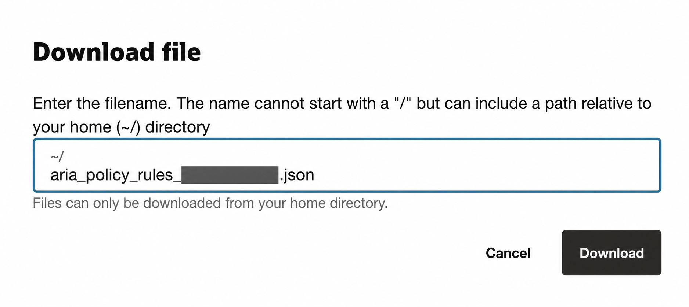

# ARIA - Analysis Risk IAM

**Subject:** ARIA - Analysis Risk IAM

ARIA is an offline macOS application for reviewing Oracle Cloud Infrastructure
(OCI) IAM policies. It collects no credentials and does not send data to OCI.
You run the included read-only exporter in OCI Cloud Shell, download the JSON
file it creates, and upload that file to ARIA for immediate local results.

## Before you start

- **macOS:** Apple Silicon (`arm64`) running macOS 26 or later.
- **OCI access:** You need permission to inspect compartments and policies in
  the tenancy. The exporter reads data only; it never changes OCI resources.
- **Home region:** Before opening Cloud Shell, switch the OCI Console to your
  tenancy's **home region**.

## Simple procedure

### 1. Download ARIA

Download the current macOS archive from this repository's **Releases** page,
extract it, and keep these two items together:

```text
ARIA - Analysis Risk IAM.app
aria_rule_exporter.sh
```

### 2. Upload the exporter to OCI Cloud Shell

In OCI Console, confirm that you are in your tenancy's **home region**, then
open **Cloud Shell**.

From the Cloud Shell menu in the top-right corner, select **Upload**. Drag
`aria_rule_exporter.sh` into the upload area and complete the upload.

User and tenancy names are masked in this example:


### 3. Generate the policy export

In the Cloud Shell terminal, run:

```bash
chmod +x aria_rule_exporter.sh
./aria_rule_exporter.sh
```

The script scans the tenancy and accessible active compartments using only
read-only OCI IAM commands. It writes a JSON file in your Cloud Shell home
directory with a name similar to:

```text
aria_policy_rules_<tenancy-name>.json
```

If the script reports inaccessible compartments, the JSON is still created,
but its `errors` section identifies the incomplete coverage.

### 4. Download the JSON file

Open the Cloud Shell menu again and choose **Download**. Enter the JSON
filename shown by the exporter, then select **Download**.

The tenancy-specific part of the filename is intentionally masked in this
example:



### 5. Analyze the export in ARIA

Double-click `ARIA - Analysis Risk IAM.app`, select **Upload JSON**, choose
the downloaded JSON file, and select **Run Analysis**. ARIA immediately
creates an HTML report and JSON/CSV results in a timestamped local output
folder.

## Security and privacy

- The exporter uses Cloud Shell's existing OCI CLI session. It does not need
  API keys, passwords, Python, or local installation.
- The generated JSON can contain tenancy and policy information. Treat it as
  sensitive: do not commit it to Git or upload it to a public repository.
- ARIA works locally. It does not upload the JSON file or connect to OCI.

## macOS security note

The current build is locally signed but not yet signed with an Apple Developer
ID or notarized. macOS may show a Gatekeeper warning for browser-downloaded
copies.

## Release history

See [CHANGELOG.md](CHANGELOG.md) for application version history.
